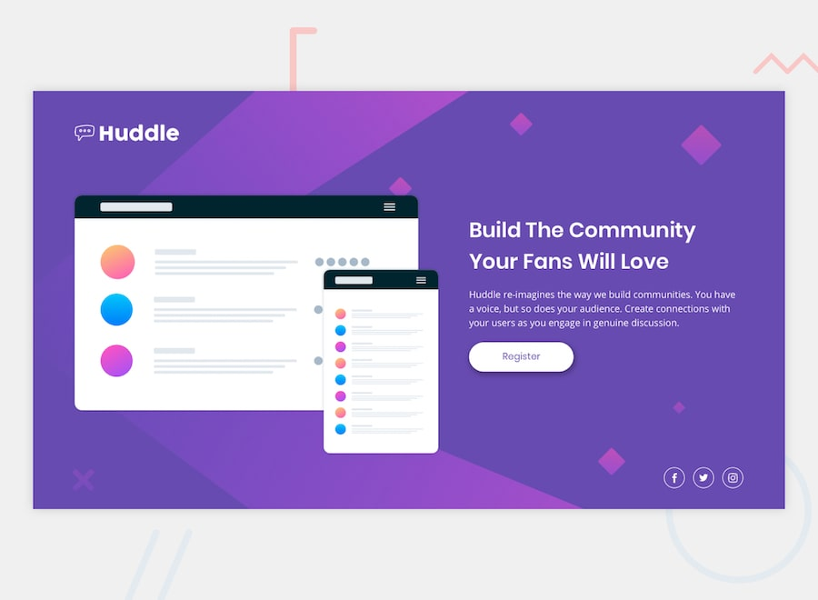

# Frontend Mentor - Huddle landing page solution

This is my solution to the Huddle landing page challenge on Frontend Mentor.

---

## Overview

### The challenge

Users should be able to:

- View the optimal layout depending on their device screen size
- See hover states for interactive elements

### Screenshot

---

## Links

- Live Site:https//huddle-landing-page-eosin-eight.vercel.app
- Solution:https://github.com/Miracle-colours/Huddle-landing-page.git

---

## My process

### Built with

- Semantic HTML5
- CSS custom properties
- Flexbox
- Responsive design

---

### What I learned

- How to structure a responsive layout using Flexbox
- How to switch between desktop and mobile background images
- How to style buttons and social icons with hover effects

---

### Continued development

- Improve responsiveness on smaller devices
- Refine spacing and alignment
- Add smoother UI interactions

---

## Author

- GitHub: https://github.com/Miracle-colours
- Frontend Mentor: https://www.frontendmentor.io/profile/Miracle-colours
- Twitter/X: https://x.com/quiet_coder19
